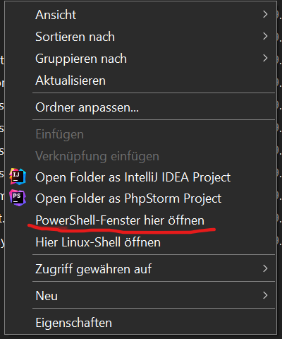

# Symfony Server für Schulprojekt

Willkommen zum Symfony-Server-Projekt! Dieses Projekt wurde im Rahmen eines Schulprojekts entwickelt und dient als Grundlage für zukünftige Entwicklungen durch andere Schüler.

## Inhaltsverzeichnis
- [Technische Voraussetzungen](#technische-voraussetzungen)
- [Installation](#installation)
  - [Scoop (Windows)](#installation-scoop-windows)
  - [PHP](#installation-php)
  - [OpenSSL](#installation-openssl)
    - [Konfiguration der OpenSSL-Erweiterung](#konfiguration-der-openssl-erweiterung)
  - [Composer](#installation-composer)
  - [Symfony](#installation-symfony)
  - [Twig](#installation-twig)
- [Symfony Server starten](#symfony-server-starten)
- [Projektstruktur](#projektstruktur)
- [Compile Frontend Changes](#compile-frontend-changes)

## Technische Voraussetzungen

Bevor Sie beginnen, stellen Sie sicher, dass Ihr System die folgenden Mindestanforderungen erfüllt:

- Windows 10 oder höher (für die Scoop-Installation)
- Mindestens 4 GB RAM
- 1 GB freier Festplattenspeicher

## Installation

Folgen Sie diesen Schritten, um Ihre Entwicklungsumgebung einzurichten:

### Installation Scoop (Windows)

1. Öffnen Sie PowerShell (**nicht als Admin**).
2. Führen Sie folgenden Befehl aus:
   ```shell
   Set-ExecutionPolicy -ExecutionPolicy RemoteSigned -Scope CurrentUser
   ```
3. Installieren Sie Scoop mit diesem Befehl:
   ```shell
   irm get.scoop.sh | iex
   ```

### Installation PHP

1. Installieren Sie PHP mit Scoop:
   ```shell
   scoop install php
   ```
2. Überprüfen Sie die Installation:
   ```shell
   php --version
   ```

   **Anmerkung:** Diese Webseite nutzt Symfony 7.2, das die PHP Version 8.2 (oder neuer) benötigt.

### Installation OpenSSL

1. Installieren Sie OpenSSL mit Scoop:
   ```shell
   scoop install openssl
   ```

#### Konfiguration der OpenSSL-Erweiterung

1. Öffnen Sie die `php.ini`-Datei. Hinweis: Geben Sie in der PowerShell `php --ini` ein, dort wird der Pfad der ini
   Datei angezeigt ggf. eine neue erstellt, wenn keine gefunden wurde.
2. Suchen Sie nach der Zeile mit `extension=openssl` und entfernen Sie das Semikolon am Anfang, falls vorhanden.
3. Speichern Sie die Datei und starten Sie Ihren Windows PC neu.

### Installation Composer

1. Installieren Sie Composer mit Scoop:
   ```shell
   scoop install composer
   ```
2. Überprüfen Sie die Installation:
   ```shell
   composer --version
   ```

### Installation Symfony

1. Installieren Sie das Symfony CLI-Tool:
   ```shell
   scoop install symfony-cli
   ```
2. Überprüfen Sie die Installation:
   ```shell
   symfony --version
   ```

### Installation Twig

Twig wird automatisch als Abhängigkeit installiert, wenn Sie ein Symfony-Projekt erstellen.

## Symfony Server starten
1. Öffnen Sie das Projekt im Explorer, anschließend drücken Sie Shift + rechte Maustaste und wählen `PowerShell hier öffnen`
   
2. Starten Sie den Symfony-Entwicklungsserver:
   ```shell
   symfony server:start
   ```

## Projektstruktur

Hier ist eine Übersicht über die wichtigsten Verzeichnisse und Dateien in einem Symfony-Projekt:

- `config/`: Konfigurationsdateien
- `public/`: Öffentlich zugängliche Dateien
- `src/`: PHP-Quellcode
- `templates/`: Twig-Templates
- `tests/`: Automatisierte Tests
- `.env`: Umgebungsvariablen


* Install NPM and run npm install

    * Compile your assets: npm run dev

    * Or start the development server: npm run watch

## Compile Frontend Changes

Wenn man css oder JS änderungen nicht direkt sieht, dann muss man in der console:

```shell
    npm run watch
```

## Twig

Wir nutzen das Twig-Bundle das die HTML entwicklung vereinfacht. Wir können innerhalb der HTML-Struktur auf PHP
funktionen zugreifen

### Automatische URL auflösung 

Wenn wir im Controller die Routen Annotation nutzen, können wir neben dem Path auch einen Namen dieser URL geben. 

```

```


```php
{{ url('ROUTEN_NAME')}}
```
